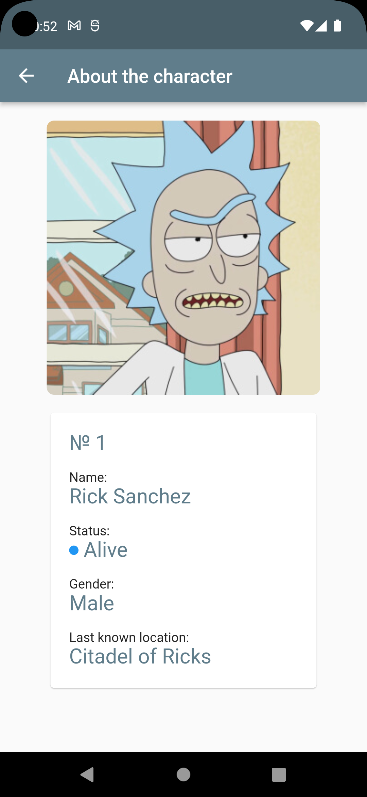
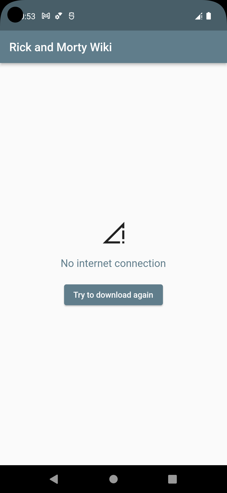

# Rick_and_Morty_wiki
Данный репозиторий содержит проект в виде мобильного приложения, написанного на языке Dart с фреймворком Flutter.
Работа приложения заключается в том, что оно отправляет запросы через API ресурсу и получает данные в формате JSON
Ссылка на ресурс: 
https://rickandmortyapi.com/ 

Данные в формате JSON десериализируются в объекты классов для дальнейшей обработки и отображения в UI приложения

Скриншоты:

<ul>Гавное окно при запуске</ul>

 
<ul>Внутреннее окно при нажатии на персонажа</ul>

 
<ul>Окно при потери подключения к сети</ul>

